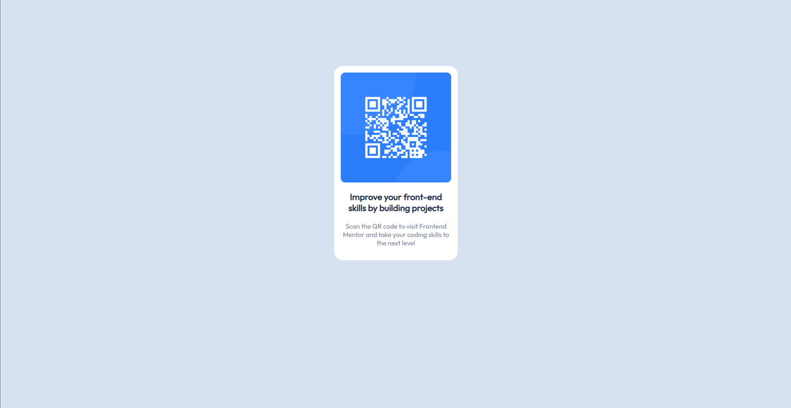

# Frontend Mentor - QR code component solution

This is a solution to the [QR code component challenge on Frontend Mentor](https://www.frontendmentor.io/challenges/qr-code-component-iux_sIO_H). Frontend Mentor challenges help you improve your coding skills by building realistic projects. 

## Table of contents

- [Overview](#overview)
  - [Screenshot](#screenshot)
  - [Links](#links)
- [My process](#my-process)
  - [Built with](#built-with)
  - [What I learned](#what-i-learned)
  - [Continued development](#continued-development)
- [Author](#author)
- [Acknowledgments](#acknowledgments)

## Overview

### Screenshot


This is a screenshot when viewed through desktop browser. Can be compared to the preview on th efirst image

### Links

- Solution URL: [Github](https://github.com/anneelv/fem_qrcode)

## My process

### Built with

- HTML
- CSS

### What I learned

In this project I learned few things:
1. Using imported fonts from google fonts
```
<link href="https://fonts.googleapis.com/css?family=Outfit" rel="stylesheet" type="text/css"> 
```
2. Styling with CSS and bordering
```
img {
    position: relative;
    display: block;
    width: 250px;
    height: 250px;
    border-top-left-radius: 10px;
    border-top-right-radius: 10px;
    border-bottom-left-radius: 10px;
    border-bottom-right-radius: 10px;
}
```


### Continued development

This is the first time I tried to design frontend using HTML and especially CSS. Moving forward, I would like to use framework such as Next.js and Tailwind CSS to create this project.

## Author

- Frontend Mentor - [@anneelv](https://www.frontendmentor.io/profile/anneelv)

## Acknowledgments

Thanks to FreeCodeCamp to help me learn about the basics of HTML and CSS to create this project.
